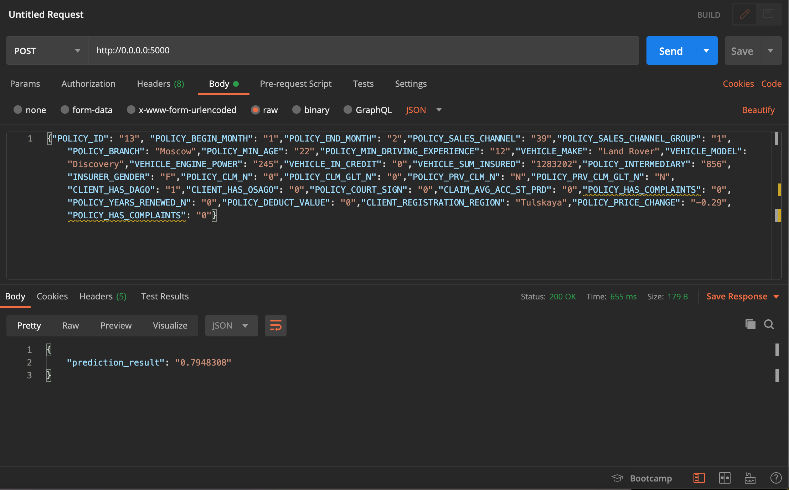

# Прогнозирование оттока клиентов

### Суть бизнес задачи: 

Каждый год компания пролонгирует полисы Каско клиентов - физических лиц. Для оптимизации работы со списками на пролонгацию необходимо прогнозировать с какой вероятностью каждый из клиентов пролонгируется и какие факторы на это влияют. В зависимости от этого расставляются приоритеты операторам колл-центра, которые обрабатывают список (осуществляют обзвон клиентов), а также принимаются решения по дополнительной мотивации клиентов к пролонгации.

---

Ссылка на используемую в продукции модель: <https://github.com/INI-MED/mindset-model>

#### Запуск контейнера:

```
docker-compose up --build
```
---

#### Пример запроса через терминал:

```
curl -X POST -H "Content-Type: application/json" -d '{\
"POLICY_ID": "13", "POLICY_BEGIN_MONTH": "1",\
"POLICY_END_MONTH": "1", "POLICY_SALES_CHANNEL": "39",\
"POLICY_SALES_CHANNEL_GROUP": "1","POLICY_BRANCH": "Moscow",\
"POLICY_MIN_AGE": "51","POLICY_MIN_DRIVING_EXPERIENCE": "12",\
"VEHICLE_MAKE": "Land Rover","VEHICLE_MODEL": "Discovery",\
"VEHICLE_ENGINE_POWER": "245","VEHICLE_IN_CREDIT": "0",\
"VEHICLE_SUM_INSURED": "1283202","POLICY_INTERMEDIARY": "856",\
"INSURER_GENDER": "F","POLICY_CLM_N": "0",\
"POLICY_CLM_GLT_N": "0","POLICY_PRV_CLM_N": "N",\
"POLICY_PRV_CLM_GLT_N": "N","CLIENT_HAS_DAGO": "1",\
"CLIENT_HAS_OSAGO": "0","POLICY_COURT_SIGN": "0",\
"CLAIM_AVG_ACC_ST_PRD": "0","POLICY_HAS_COMPLAINTS": "0",\
"POLICY_YEARS_RENEWED_N": "0","POLICY_DEDUCT_VALUE": "0",\
"CLIENT_REGISTRATION_REGION": "Tulskaya","POLICY_PRICE_CHANGE": "-0.29",\
"POLICY_HAS_COMPLAINTS": "0"\
}' http://0.0.0.0:5000
```
---

#### Результат работы сервиса: 


